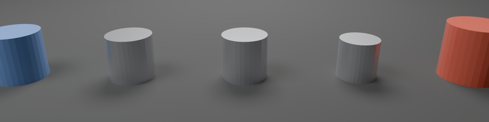

# Neve Knobs Project

Procedural Neve-style audio knobs generated with Blender Geometry Nodes and Shader Nodes.

## Preview



## Knob Styles

| Style | Color | Features |
|-------|-------|----------|
| **Style 1** | Blue | Glossy cap, no pointer, single-piece |
| **Style 2** | Silver | Metallic, ridged skirt, pointer |
| **Style 3** | Silver | Metallic, deep ridged skirt, pointer |
| **Style 4** | Silver | Small, shallow ridges, pointer |
| **Style 5** | Red | Glossy, tall, prominent pointer |

## Usage

```bash
# Build a single knob
blender -b -P scripts/run_task.py -- projects/neve_knobs/tasks/knob_style5_red.yaml

# Build all knobs
for style in 1 2 3 4 5; do
  blender -b -P scripts/run_task.py -- projects/neve_knobs/tasks/knob_style${style}_*.yaml
done

# Render composite image
blender -b -P projects/neve_knobs/scripts/render_final.py
```

## Parameters

Each knob style is defined by a YAML task file with these parameters:

```yaml
parameters:
  # Geometry
  cap_height: 0.025       # Height of cap (meters)
  cap_diameter: 0.020     # Diameter of cap
  skirt_height: 0.010     # Height of skirt section
  skirt_diameter: 0.022   # Diameter at skirt base
  ridge_count: 24         # Number of grip ridges (0 = smooth)
  ridge_depth: 0.001      # Depth of ridges

  # Material
  base_color: [0.85, 0.15, 0.1]  # RGB (0-1)
  metallic: 0.0           # Metallic value (0-1)
  roughness: 0.25         # Surface roughness (0-1)
  clearcoat: 0.8          # Clearcoat intensity (0-1)
```

## Output Artifacts

- `build/neve_knob_style1_blue.glb`
- `build/neve_knob_style2_silver.glb`
- `build/neve_knob_style3_silver.glb`
- `build/neve_knob_style4_silver.glb`
- `build/neve_knob_style5_red.glb`
- `build/neve_knobs_preview.png` (composite render)
